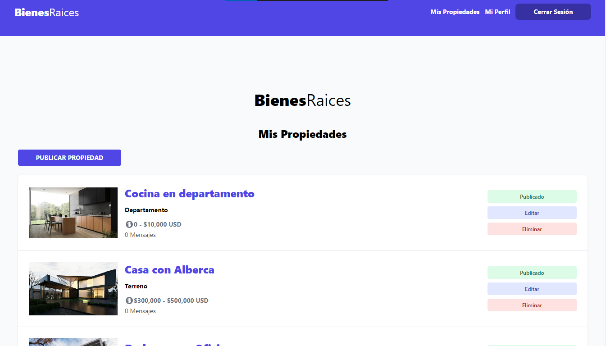

# Bienes Raices 1.0.0 

Proyecto de Bienes Raices, con NodeJs y MySQL, que nos permite publicar propiedades, teniendo las funcionalidades de un CRUD

## Tabla de Contenido

- [Requisitos](#Requisitos)
- [Demo](#Demo)
- [Instalación](#instalación)
- [Uso](#uso)
- [Contribución](#contribución)
- [Licencia](#licencia)

## Requisitos

- Node.js (versión 19.4.0)
- MySQL (versión 8.0)
- Tailwind (versión 3)

## Demo



## Instalación

Descarga de las dependencias.

```bash
npm install
```

## Uso

Explica cómo utilizar tu proyecto. Proporciona ejemplos, código de muestra o instrucciones claras para que los usuarios puedan sacar el máximo provecho de él.

## Contribución

Si permites contribuciones de la comunidad, describe cómo otros pueden contribuir al proyecto. Puedes explicar cómo reportar problemas, enviar solicitudes de extracción, etc.

## Licencia

Indica la licencia bajo la cual se distribuye tu proyecto. Por ejemplo, MIT, Apache, GNU, etc.

---

**Nota:** Esta es una plantilla básica. Puedes personalizarla y agregar secciones adicionales según sea necesario para tu proyecto.
